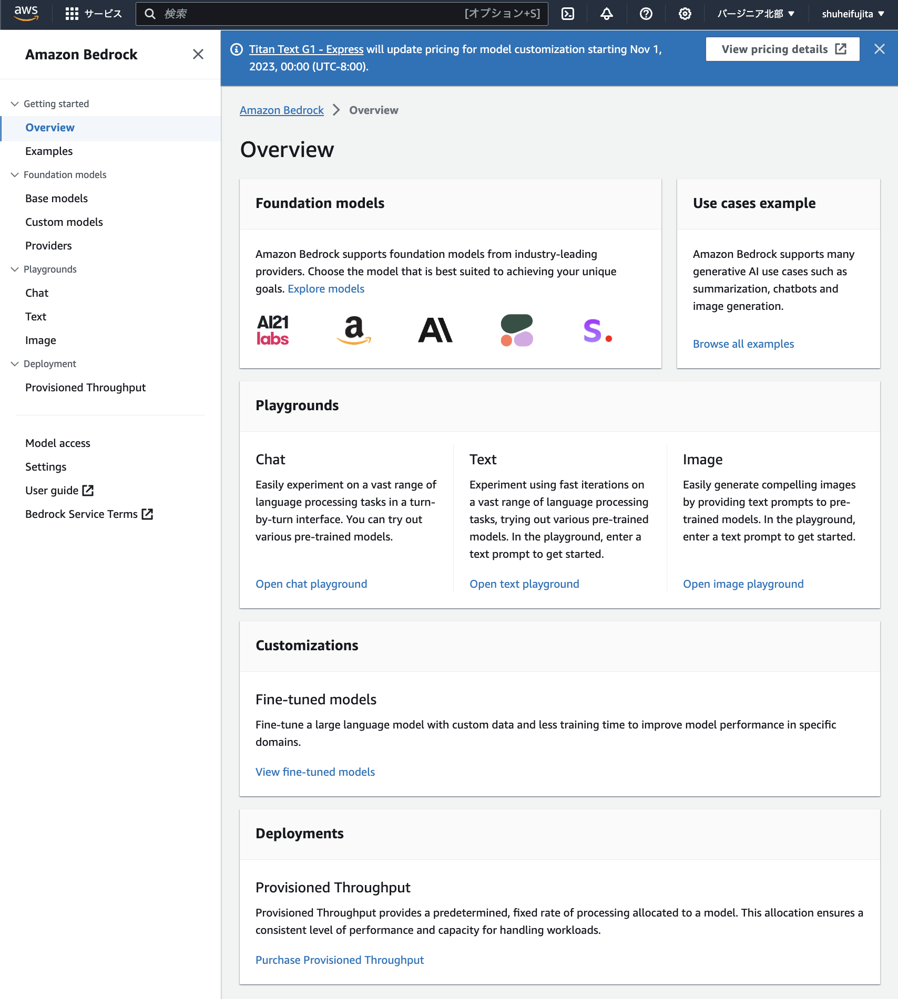
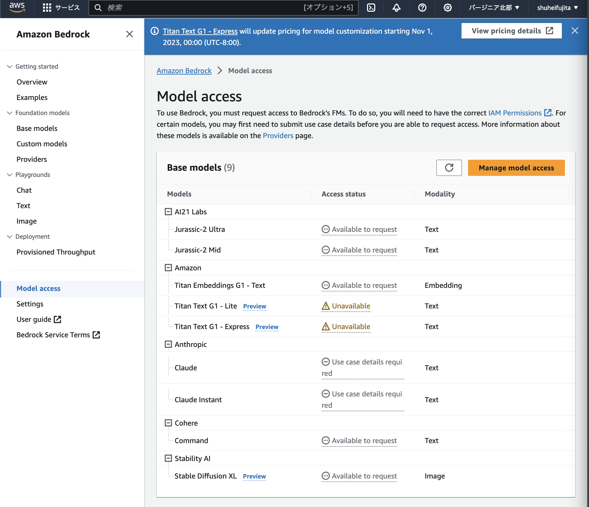

# AWS Bedrock

AWS Bedrock環境のLLMを提供するのAPIを使用するスクリプトを提供します

ex) .env
```plaintext
API_KEY=
```

## 参考文献

公式ドキュメント
- https://catalog.us-east-1.prod.workshops.aws/workshops/a4bdb007-5600-4368-81c5-ff5b4154f518/ja-JP/20-intro/21-environmentsetup
- https://aws.amazon.com/jp/bedrock/
- https://github.com/aws-samples/amazon-bedrock-workshop

AWS Bedrockの概要



AWS Bedrockで使用可能なLLMモデル



Playground(Chat, Text, Image)

https://dev.classmethod.jp/articles/breaing-news-amazon-bedrock-was-released/
